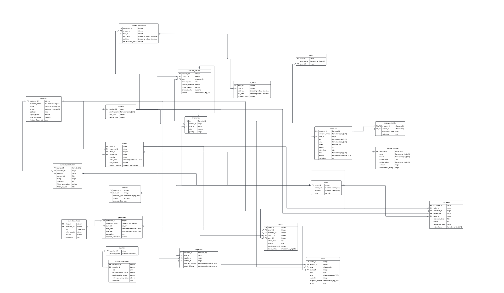

# Apan5310-Final
Thie is the term project submission for group 4 - spring 2024

# ABC FoodMart

## Assumptions：
1. Assume there are 5 stores for ABC FoodMart
2. Assume clients are paying by 'Credit Card', 'Debit Card', 'Cash', 'PayPal', 'Apple Pay'
3. 

## Create Database Using PgAdmin
Create database `Schema Design.sql`

## ETL Process
`Group4 ETL process.ipynb`

## Insert Table
`Inserting tables.ipynb`

## Tables
`tables.zip`

## Insights 
`insights.sql`
